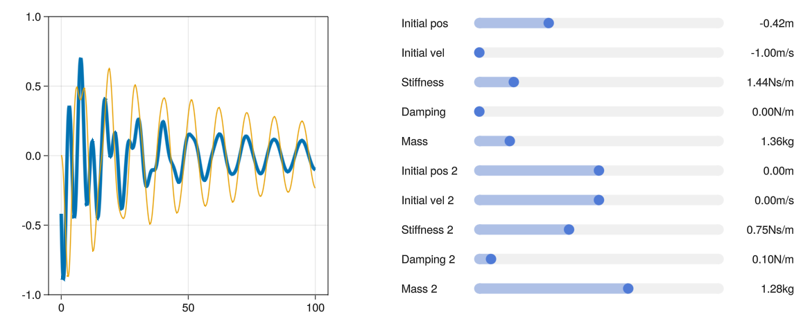
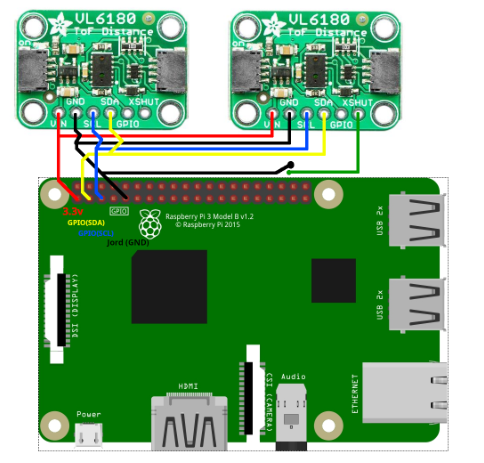
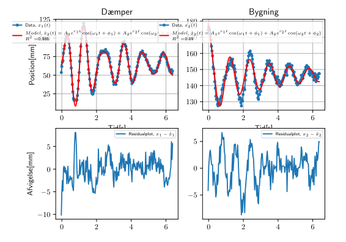
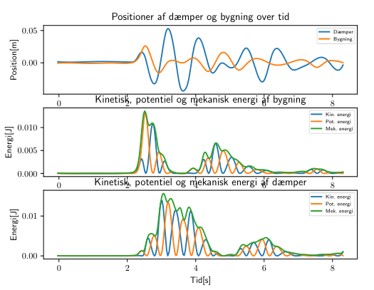

<h1>
  I no longer use GitHub, go to my <a href="https://git.argmin.dk/joshnie"> self-hosted Forgejo </a> server instead for my work and projects.
</h1>
# TunedMassDamper

Repo contains multiple scripts used in conjunction with a project attempting to acquire an insight into the coupling of a mass damper to an oscillating object and the resulting mechanisms to dissipate energy.

## dataCollection
Contains python code to be used with an R-Pi and two VL6180X sensors.  

XSHUT to the second sensor is pulled low to prevent it from interfering with the first sensor at the start of the program, and then pulled high to allow it to be used.
Wiring diagram:

## plotting
Code to process data acquired by R-Pi, contains two scripts:
* plotData.py - plots the data from the R-Pi with residual plots and regression models to determine the best fit for the coupled tuned mass damper system.

* mechEnergy.py - plots the mechanical energy of the system as a function of time, and the mechanical energy of the system as a function of the displacement of the mass, here it can be seen that the mechanical energy is dissipated by the damper.

Visualisation from plotData.py:  

Visualisation from mechEnergy.py:  

## Simulation.jl
Contains code to simulate the coupled tuned mass damper system, and to plot the results. Written in Julia with GLMakie for gpu accelerated plotting. Folder contains two scripts:
* simTMD.jl - contains the code to simulate the coupled tuned mass damper system, and returns the results in a gif.
* interactive.jl - contains the code to simulate the coupled tuned mass damper system with an interactive session in GLMakie, allowing the user to change the parameters of the system and see the results.

interactive.jl:

